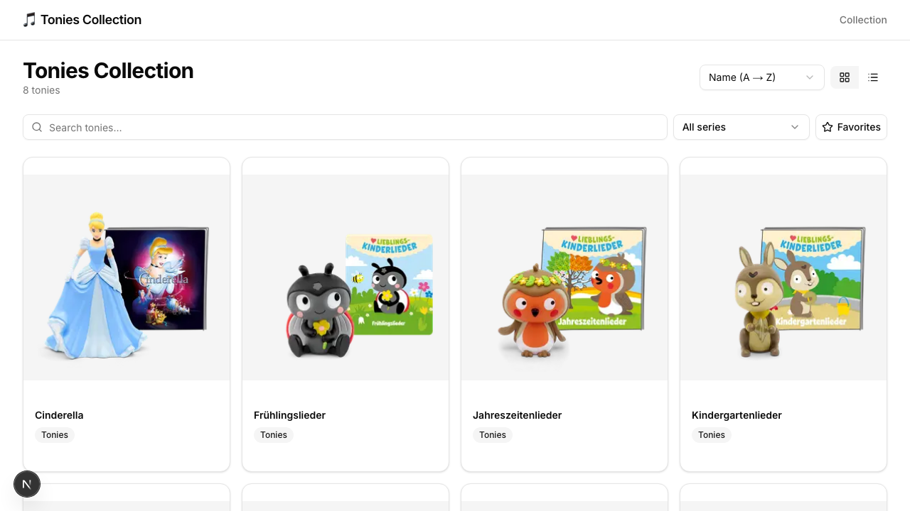
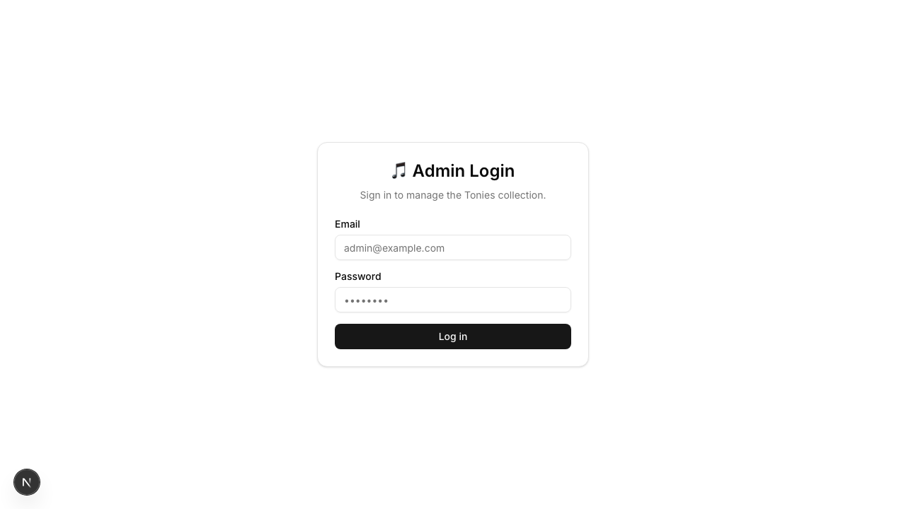

# Tonies Collection

A modern, full-stack Next.js 15 + Supabase application for cataloging and managing your Tonie box figure collection.



## Features

- **Public Catalog**: Browse, search, filter, and sort your Tonie collection.
- **Admin Dashboard**: Secure authentication and management interface.
- **CRUD Operations**: Create, Read, Update, and Delete figures.
- **URL Import**: Import figure data directly from tonies.com URLs (scrapes metadata, downloads images).
- **Responsive Design**: Mobile-friendly UI built with Tailwind CSS and Shadcn UI.
- **Internationalization**: Initial setup for i18n support (currently English only).

## Tech Stack

- **Framework**: [Next.js 15](https://nextjs.org/) (App Router, Server Actions)
- **Language**: [TypeScript](https://www.typescriptlang.org/)
- **Styling**: [Tailwind CSS v4](https://tailwindcss.com/) + [Shadcn UI](https://ui.shadcn.com/)
- **Database**: [Supabase](https://supabase.com/) (PostgreSQL + Auth + Storage)
- **Imports**: Custom parser for extracting product data from tonies.com (uses `__NEXT_DATA__`, JSON-LD, and OG tags).
- **Testing**: Vitest (Unit/Component) + Playwright (E2E).

## Getting Started

### Prerequisites

- Node.js 18+
- Use a Supabase project (free tier works great).

### Installation

1. Clone the repository:
   ```bash
   git clone https://github.com/<your-username>/tonies-collection.git
   cd tonies-collection
   ```

2. Install dependencies:
   ```bash
   npm install
   ```

3. Configure environment variables:
   Copy `.env.local.example` (or create `.env.local`) and add your Supabase credentials:
   ```env
   NEXT_PUBLIC_SUPABASE_URL=https://<your-project-ref>.supabase.co
   NEXT_PUBLIC_SUPABASE_ANON_KEY=<your-anon-key>
   SUPABASE_SERVICE_ROLE_KEY=<your-service-role-key>
   ```

4. Run database migrations:
   Execute the SQL files in `supabase/migrations/` via your Supabase dashboard or CLI.
   - `001_create_tonies.sql`: Creates table & policies.
   - `002_create_storage.sql`: Sets up image storage.

5. Create an admin user:
   Sign up a new user in your Supabase Auth dashboard.

6. Start the development server:
   ```bash
   npm run dev
   ```
   Open [http://localhost:3000](http://localhost:3000) to view the app.

## Testing

Run the full test suite:

```bash
# Unit + Component Tests (Vitest)
npm run test

# End-to-End Tests (Playwright)
npx playwright test
```

## Deployment

Deploy easily to **Vercel**:

1. Push your code to GitHub.
2. Import the repository in Vercel.
3. Add the environment variables from `.env.local`.
4. Deploy!


